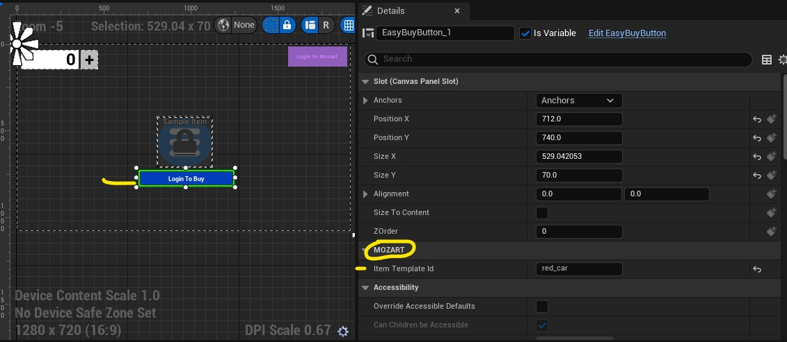

# mz-unreal
Unreal SDK for Mozart for Unreal Engine 5.1+

# Installation and Usage
Install Unreal 5.1 if you havent already.  
git clone this repository into a folder and copy the contents of Content and Plugins into your own projects respective folders.
To experiment and test you can open the MZUnreal.uproject and explore the components

When you open the project you will receive a warning that one of our plugins UEFetch was designed for an earlier version of Unreal, this is fine, just accept.
It is important that you do not modify the SDK directly, as you will not be able to enjoy updates as we release them.
If you decide to open the test project you can view the MozartDemo level to see how things are laid out.

# How to use the SDK

The SDK is designed in a way where there is a single actor called MozartManager that you must add to your startup level.  This Actor must be configured to persist across all levels in the game (wherever you need Mozart features).  This actor handles login, session, two way communication with our API, and the data structures of the users inventory and store items.

## Configuration
Once you have added MozartManager to your level, you can click the instance of the object and look for the CONFIGURATION subheading.  This where you put in your GAME_ID that you got when you set up your game with us.  This identifies your game, so that people can log in and tell us which game they are logging into.  

### @ IDs
In general ID fields in Mozart are signified by an @ followed by an ID.  You may also need to add a game currency id, we will also give you this ID.  If you just want to use the default you can use @MYGAMEID.default_currency.  In the demo picture you can see the game ID is @mzkart and the currency is @mzkart.default_currency.

# Events
In this SDK there are two types of events that are used.  Events you fire intentionally to make something happen, and Events you can hook into to listen for things that changed.  Mozart requires that you manually invoke events because events can be asynchronous, and web service calls by their very nature are Async.

Let's look at some examples:
## Events to listen to for data change
### LoginComplete
LoginComplete event happens after the user successfully logs into the system.  You may want to show other UI, do a transition, or start loading game elements when this event fires.  At this point the users data is NOT yet available - we do this in a seperate call.
### UserDataChanged
This is fired after the user data changes.  This happens whenever a user buys something, they login, they spend or receive funds, or get an item added or removed from their inventory.  You can hook into this when building ui that needs to react to user data being changed by any source.
## Events to call
You call these manually using the Call Event blueprint node
### Load Store Data
Load store data is called automatically when the app starts up, but if you want to refresh store data for some reason you can invoke the event manually.  It will load the store data and put it into the STORE_ITEMS data structure on

### LoadUserData
Trigger a User Data refresh, you may want to do this after awarding an item to the player with a backend service, or taking money from the player.  This will ask the server for the latest player state and then return with it triggering UserDataChanged when it is complete.

### BuyItemEvent 
This can be used to trigger a purchase manually.  You can use EasyBuyButton to also do purchases.  This is an event, so it cannot take parameters.  In order to set the item_id to purchase you need to manually set Buy Item ID on MozartManager before triggering the Buy Event so it knows what item to purchase.  You can look at the graph for EasyBuyButton for an idea of how this works.

# Data

Data that you can view and use is stored on the MozartManager actor, it is responsible for the state of the user, their inventory, and your store items.  As you can see in the screenshot above, you can access MozartManager from any of your blueprints and read STORE_ITEMS or INVENTORY_ITEMS and do whatever you like with this data.  STORE_ITEMS is populated after LoadStoreData is completed, and INVENTORY_ITEMS is populated after UserDataChanged is completed.  All built in Mozart Widgets automatically handle and use these data structures.  This information is only really important if you want to develop your own widgets or do advanced things with the data.

# Widgets

There are 4 widgets included with the SDK, and you only really need one of them.  The Login widget is required to log in.  If the user doesn't log in we identify them, so they won't have inventory or store access.  All widgets can be skinned, it is just suggested that you move the widget files out of the main SDK so that you do not overwrite them. If there is a SDK update.

If you ever want to learn about the various widgets and what they do you can open the widget overlay demo in the sample project.

## MozartLogin
This is an easy login button, after a user clicks it they will be presented with a Google Sign In dialog.  After logging in with google they will be registered and their session will be saved in MozartManager.  All future calls will function normally.

## Mozart Balance Widget
This widget shows their balance in the default currency.  This will be populated with data after UserDataChanged has been fired.  It also comes with a nice little + button to let the user easily buy additional currency. 

## LockedItemSlot 
This widget will let you put an ItemID or ItemName into the MOZART section on the item instance.  The system is smart enough to handle any kind of ID, it will then reactively show a locked or unlocked state depending on whether the user owns the item or not.  This is useful for games with lockable characters, lockable cars, items that will be locked until the user owns a digital collectable that unlocks their access.  There is also an event on this widget to broadcast a click so that you can react to it.  Your own blueprints can listen for this event and react appropriately.  See the Overlay demo blueprint graph for an example of how this is hooked up.

## SimpleBuy
This widget will let you add a buy button that will buy an item when it is clicked.  This is also configured on an instance level by highlighting the button in the designer and then finding the MOZART subheading. There will be an Item Name field.  Simply put the exact same name as your item into this box and it will map the button to that item.  When the user clicks the buy button it will purchase and automatically fire a LoadUserData event, and all systems that listen to UserDataChanged will automatically react to this new information (including locked slots)
